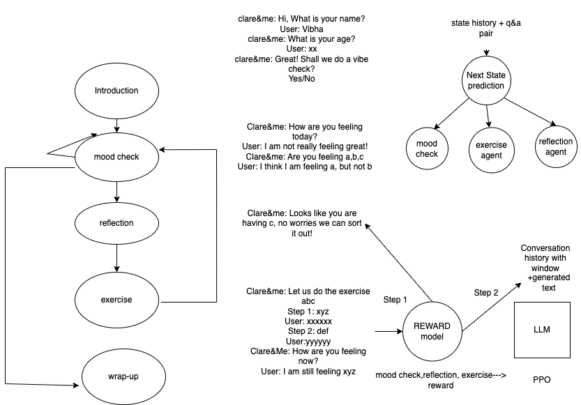

### Mission: Part 1

Implement a Python ML service, whose input is a conversation(question) and classifies into 5 possible classes.
- Regular conversations
- Product-related conversations
- Subscription-related conversations
- Suicide
- Non-mental health topics

Approach:
1) Synthetically created a dataset of questions using gpt-3.5 (~500 questions).
2) Created a Baseline Naive Bayes classifier (accuracy was around 93%).
3) Trained a BERT based classifier (accuracy was around 100%), for 10 epochs, using a A100 GPU on colab.
4) Created a fast api which takes in a question as a input and outputs one of the five classes to which the conversation belongs to.
5) Wrote simple test cases to makes sure the predict function is working as expected.

How to run? \
Step 1: ```pip install -r requirements.txt``` \
Step 2: Please download fine-tuned [model](https://drive.google.com/file/d/1AKCTkjpIWlWmE8KWbCnlAOjCJNdAIxQ4/view?usp=drive_link) \
Step 3: ```uvicorn main:app```


### Mission: Part 2




